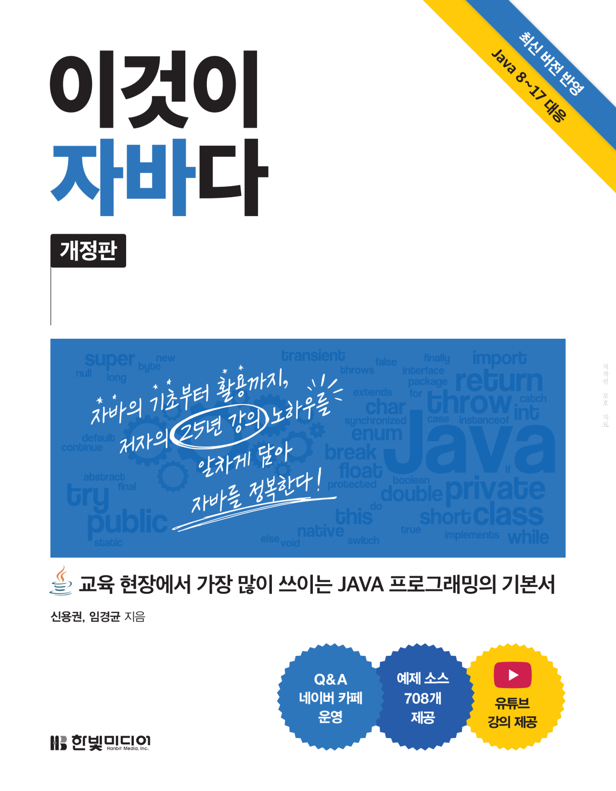

# JAVA [10.11 ~ ]

###  자바 기초 학습 [ 10.11 ~ 

  

### 자바 기초학습
            
[10.11 - 10.16] JAVA_Basic   
[10.17 - 10.00] JAVA_OOP (Object Oriented Programming)   
[10.00 - 10.00] JAVA_Library   
[10.00 - 10.00] DATA_IO   

[수업 예제코드](https://www.hanbit.co.kr/support/supplement_survey.html?pcode=B4861113361)

 
 
 

### 자바 프로젝트

