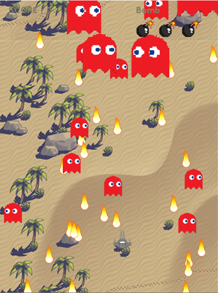
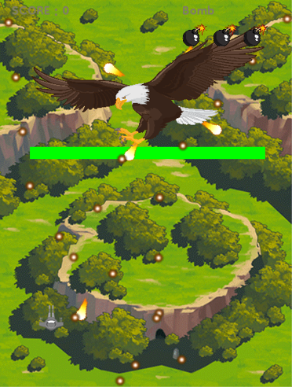

# AI Class 

[Python 포트폴리오](#Python-포트폴리오)
  - [몬스터를 찾아서](#몬스터를-찾아서)

## Python 포트폴리오

### 몬스터를 찾아서

  
  
  

- 팀프로젝트 [4인]
- Python [pygame]
- 종 스크롤 비행 슈팅 게임
- 기간 : 3주[9/21 - 10/10]
- 특이점 : 모듈화, 라이브러리화 [Background, Pool, Text]

## Web 강의
